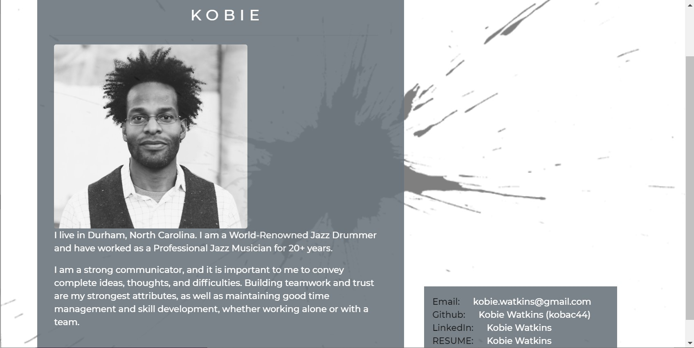
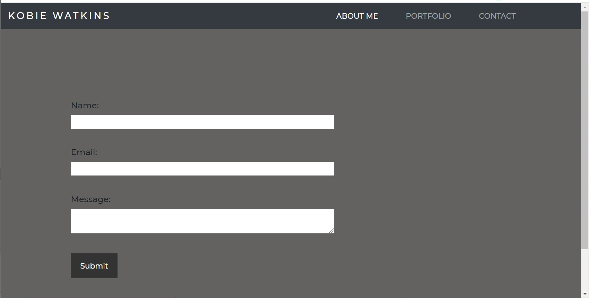

# Mobile-Responsive-Portfolio2

# Table of Contents

- [Description](#description)
- [Visual](#visual)
- [Installation](#installation)
- [Usage](#usage)
- [Contributors](#contributors)
- [GitHub Informationl](#github-information)
- [Questions](#questions)

## Description

Kobie Watkins mobile responsive portfolio, is the updated version of his status and job focus, strengths and weaknesses and the site itself coded and designed.

## Visuals

The visuals used were personal photos and a aesthetically pleasing Professional Portfolio.

## Contributors

-YouTube

-Borjan Bartula

# GitHub

## https://github.com/kobac44

## Portfolio Images

